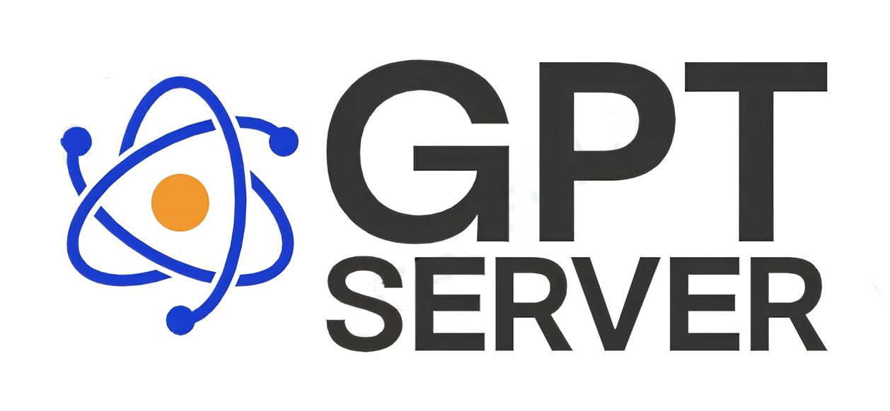
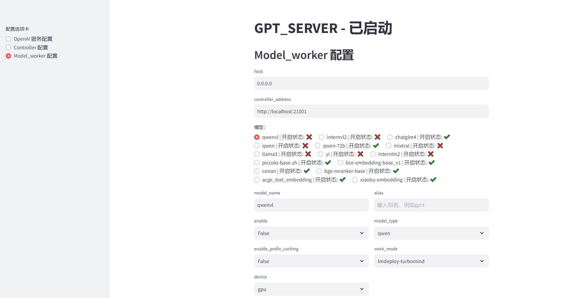
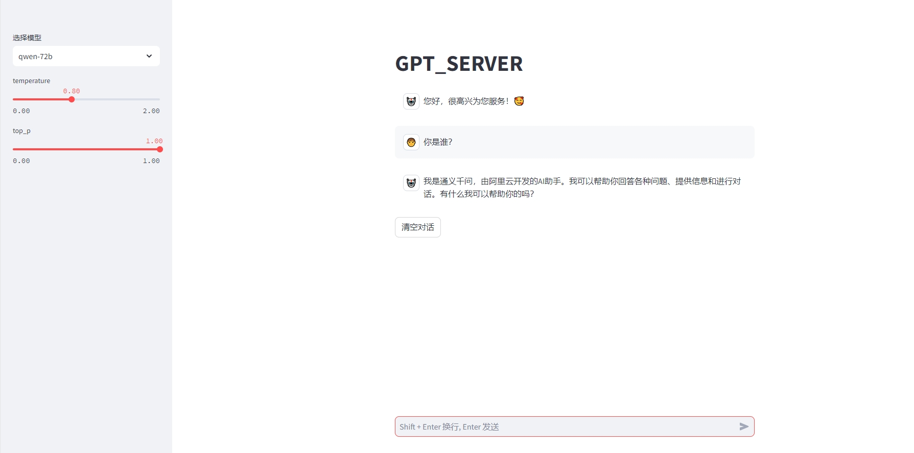
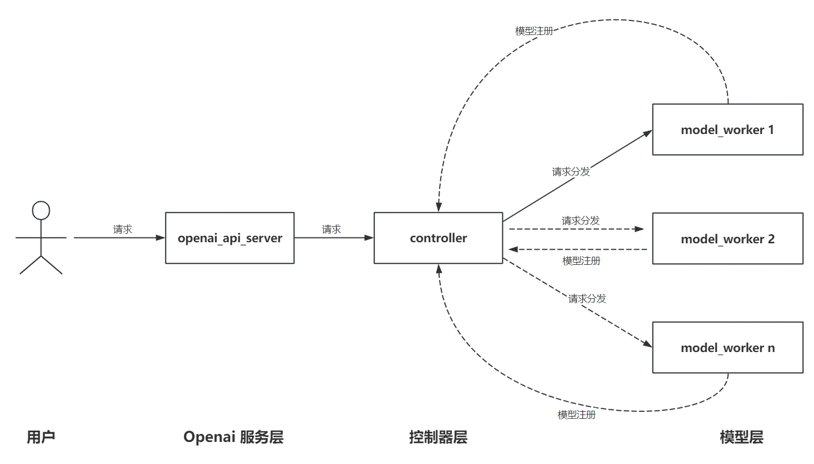

<div align="center">

<a href="https://github.com/shell-nlp/gpt_server"></a>

# GPT Server
[![License][license-shield]][license-url]
[![Stars][stars-shield]][stars-url]
[![Forks][forks-shield]][forks-url]
[![Docker pulls][docker-pulls]][docker-pulls]
[![CI Status][ci-shield]][ci-url]
[![issue resolution][closed-issues-shield]][closed-issues-url]

</div>

This project builds on FastChat's foundation to provide **OpenAI server** capabilities.

1. Supports **Chat**, **Embedding**, **ReRanker**, **text-moderation (text review, classification)**, **ASR**, **TTS (with voice cloning)**, and **SD (Stable Diffusion, text-to-image)** models with **OpenAI** specification API services.
2. Supports multiple accelerated inference backend engines including **HF**, **vLLM**, **LMDeploy**, and **SGLang**.
3. Multiple models can share the same port of the **OpenAI server** for calls, with automatic model scheduling.

If GPT Server is helpful to you, please leave a ⭐ Star!
<br>

## ✨ Key Features
|     | Feature          | Description                                                                |
|-----|-------------|-------------------------------------------------------------------|
| 🎨  | **OpenAI Service API**     | Supports `OpenAI` service API specifications, compatible with all projects that support OpenAI                                          |
| 🚀  | **Multi-Backend Inference** | Supports multiple high-performance inference engines: `vLLM`, `SGLang`, `LMDeploy`, `HF` |
| 🎯  | **Embedding/Reranker** | Supports all semantic vector or reranking models compatible with `Sentence_Transformers`, includes Infinity backend, **Embedding** inference speed faster than onnx/tensorrt, supports dynamic batching |
| 🎛️ | **Text-moderation (Text Review, Classification)**   | Supports `OpenAI` service API specifications for text review and classification                                                |
| 📱  | **ASR (Speech-to-Text)**    | Supports ASR models based on `FunASR`                                        |
| 🔊  | **TTS (Text-to-Speech)**   | Supports TTS models based on `SparkTTS`, supports acceleration with `vLLM`, `SGLang` backends, `RTF<<1`, supports streaming audio output                                          |
| 🖌️  | **SD (Stable Diffusion, Text-to-Image)**    | Supports `text-to-image` models based on `diffusers`                                        |
| 🔄  | **LM/VL Model Support**  | Supports various large language models or multimodal language models                                              |
| 🎭  | **Inference Service Performance Testing**   | Implements service performance metrics like `Throughput`, `TTFT`, `TPOT` based on `Evalscope`                                                  |

<br>

- Supports guided_decoding, forcing models to output in JSON format according to Schema requirements.
- Supports **Tools (Function Calling)** functionality, and optimizes tool parsing methods to greatly improve tool call success rates. Compatible with **LangChain**'s **bind_tools** and **with_structured_output** syntax (currently supports Qwen and GLM series)
- Supports **cohere** library interface specification /v1/rerank endpoint, available in dify.
- World's first extension of **openai** library to implement Reranker models (rerank, /v1/rerank). (Code example: gpt_server/tests/test_openai_rerank.py)
- World's first support for **openai** library's text moderation model interface (text-moderation, /v1/moderations). (Code example: gpt_server/tests/test_openai_moderation.py)
- World's first support for **openai** library's TTS model interface (tts, /v1/audio/speech) (Code example: gpt_server/tests/test_openai_tts_stream.py)
- World's first support for **openai** library's ASR model interface (asr, /v1/audio/transcriptions), based on funasr backend (Code example: gpt_server/tests/test_openai_transcriptions.py)
- World's first support for **openai** library's SD, text-to-image model interface (sd, /v1/images/generations), based on diffusers backend (Code example: gpt_server/tests/test_image_gen.py)

## 🖼️ Configuration Documentation
Through this example file, you can quickly master the project's configuration methods.
<br>
**Detailed configuration file information is located at: [config_example.yaml](https://github.com/shell-nlp/gpt_server/blob/main/gpt_server/script/config_example.yaml "Configuration File")**

## 🎉 Latest Updates
<details open>
<summary><b>2025</b></summary>

```plaintext
2025-8-8   Initial support for vLLM acceleration for embedding
2025-6-17  Supported jina-reranker-m0, world's first multimodal multilingual reranking model
2025-6-12  Supported text-to-image model flux (code example: gpt_server/tests/test_image_gen.py)
2025-6-6   Supported bge-vl series (code example: gpt_server/tests/test_openai_embedding_vl.py)
2025-6-6   Supported ritrieve_zh_v1
2025-4-29  Supported Qwen3
2025-4-24  Supported TTS with Spark-TTS backend
2025-4-14  Supported SGLang backend and partial VL models
2025-4-2   Supported OpenAI ASR interface /v1/audio/transcriptions
2025-4-1   Supported internvl2.5 model
2025-2-9   Supported QVQ
```
</details>

<details close>
<summary><b>2024</b></summary>

```plaintext
2024-12-22 Supported TTS, /v1/audio/speech TTS models
2024-12-21 Supported text-moderation, /v1/moderations text moderation models
2024-12-14 Supported phi-4
2024-12-7  Supported /v1/rerank interface
2024-12-1  Supported QWQ-32B-Preview
2024-10-15 Supported Qwen2-VL
2024-9-19  Supported minicpmv model
2024-8-17  Supported lora deployment for vllm/hf backends
2024-8-14  Supported InternVL2 series multimodal models
2024-7-28  Supported dynamic batching acceleration for embedding/reranker (infinity backend, faster than onnx/tensorrt)
2024-7-19  Supported LMDeploy PyTorch backend for multimodal model glm-4v-gb
2024-6-22  Supported function call (tools) capabilities for Qwen and ChatGLM series
2024-6-12  Supported qwen-2
2024-6-5   Supported Yinka, zpoint_large_embedding_zh embedding models
2024-6-5   Supported glm4-9b series (hf and vllm)
2024-4-27  Supported LMDeploy accelerated inference backend
2024-4-20  Supported llama-3
2024-4-13  Supported deepseek
2024-4-4   Supported embedding model acge_text_embedding
2024-3-9   Supported reranker models (bge-reranker, bce-reranker-base_v1)
2024-3-3   Supported internlm-1.0, internlm-2.0
2024-3-2   Supported qwen-1.5 0.5B, 1.8B, 4B, 7B, 14B, and 72B
2024-2-4   Supported vllm implementation
2024-1-6   Supported Yi-34B
```
</details>

<details close>
<summary><b>2023</b></summary>

```plaintext
2023-12-31 Supported qwen-7b, qwen-14b
2023-12-30 Supported all-embedding (theoretically supports all word embedding models)
2023-12-24 Supported chatglm3-6b
```
</details>

## 🧭 Roadmap

* [X] Support HF backend
* [X] Support vLLM backend
* [X] Support LMDeploy backend
* [X] Support SGLang backend
* [X] Support text-to-speech TTS models
* [X] Support speech-to-text ASR models
* [X] Support text moderation models
* [X] Support function call functionality (tools) (Qwen and ChatGLM series already supported, will expand based on demand)
* [X] Support multimodal models (initial support for glm-4v, other models to be added gradually)
* [X] Support dynamic batching for Embedding models (implementation: infinity backend)
* [X] Support dynamic batching for Reranker models (implementation: infinity backend)
* [X] Visual startup interface (unstable, not very useful for developers, will be deprecated later!)
* [X] Parallel function call functionality (tools)
* [X] Support text-to-image models
* [ ] Support pip install installation method


## ⚙️ Quick Start

### 1. Configure Python Environment

#### 1.1 Install with uv (Recommended, currently the best library management tool, with performance and usability far superior to pip, conda, poetry, etc. Used by major open source projects.)

```bash
# Install uv
pip install uv -U # Or check tutorial https://docs.astral.sh/uv/getting-started/installation/#standalone-installer
# uv venv --seed # (Optional) Create uv virtual environment and set seed
uv sync
source .venv/bin/activate # Activate uv environment
```

#### 1.2 Install with conda (Will be deprecated later, optional)

```bash
# 1. Create conda environment
conda create -n gpt_server python=3.10

# 2. Activate conda environment
conda activate gpt_server

# 3. Install repository (must use install.sh to avoid dependency conflicts)
bash install.sh
```

### 2. Modify Startup Configuration File

#### 2.1 Copy Example Configuration File:
**Detailed configuration file information is located at: [config_example.yaml](https://github.com/shell-nlp/gpt_server/blob/main/gpt_server/script/config_example.yaml "Configuration File")**

```bash
# Enter script directory
cd gpt_server/script
# Copy example configuration file
cp config_example.yaml config.yaml
```

### 3. Start Service
#### 3.1 Command Line Startup

```bash
uv run gpt_server/serving/main.py
```
or
```bash
sh gpt_server/script/start.sh
```
or
```bash
python gpt_server/serving/main.py
```

#### 3.2 Docker Startup

##### 3.2.0 Use Docker Hub Image
```bash
docker pull 506610466/gpt_server:latest # If pull fails, try the method below
# If unable to pull Docker images from mainland China, try the domestic mirror source below (not guaranteed to be always available)
docker pull docker.1ms.run/506610466/gpt_server:latest
```

##### 3.2.1 Manual Image Build (Optional)
- Build Image

```bash
docker build --rm -f "Dockerfile" -t gpt_server:latest "."
```
##### 3.2.2 Docker Compose Startup (Recommended to use docker-compose in the project)

```bash
docker-compose -f "docker-compose.yml" up -d --build gpt_server
```

<details close>
<summary> <b> 3.3 Visual UI Service Startup (Has Bugs, Deprecated, Welcome Experts to Optimize Code)</b></summary>

#### 3.3 Visual UI Service Startup (Optional, has bugs, not recommended, welcome experts to optimize code)

```bash
cd gpt_server/serving
streamlit run server_ui.py
```

##### 3.3.1 Server UI Interface:



</details>

### 4. Use OpenAI Library for Calls

**See example test code in gpt_server/tests directory:
https://github.com/shell-nlp/gpt_server/tree/main/tests**

### 5. Use Chat UI

```bash
cd gpt_server/gpt_server/serving
streamlit run chat_ui.py
```

Chat UI Interface:




## ⚡ Supported Models and Inference Backends

**Inference Speed:** LMDeploy TurboMind > SGLang > vllm > LMDeploy PyTorch > HF

### Official Model Support by Inference Backend

[LMDeploy](https://lmdeploy.readthedocs.io/en/latest/supported_models/supported_models.html)

[vLLM](https://docs.vllm.ai/en/latest/models/supported_models.html)

[SGLang](https://docs.sglang.ai/supported_models/generative_models.html)

This project can achieve compatibility with officially supported models within five minutes, but due to time constraints, only commonly used models are currently supported. If you need support for other models, please submit an Issue.

### **LLM**

|   Models / BackEnd    | model_type |  HF   | vllm  | LMDeploy TurboMind | LMDeploy PyTorch | SGLang |
| :-------------------: | :--------: | :---: | :---: | :----------------: | :--------------: | :----: |
|      chatglm4-9b      |  chatglm   |   √   |   √   |         √          |        √         |   √    |
|      chatglm3-6b      |  chatglm   |   √   |   √   |         ×          |        √         |   √    |
| Qwen (7B, 14B, etc.) |    qwen    |   √   |   √   |         √          |        √         |   √    |
| Qwen-1.5 (0.5B--72B)  |    qwen    |   √   |   √   |         √          |        √         |   √    |
|        Qwen-2         |    qwen    |   √   |   √   |         √          |        √         |   √    |
|       Qwen-2.5        |    qwen    |   √   |   √   |         √          |        √         |   √    |
|        Qwen-3         |    qwen    |   √   |   √   |         √          |        √         |   √    |
|        Yi-34B         |     yi     |   √   |   √   |         √          |        √         |   √    |
|     Internlm-1.0      |  internlm  |   √   |   √   |         √          |        √         |   √    |
|     Internlm-2.0      |  internlm  |   √   |   √   |         √          |        √         |   √    |
|       Deepseek        |  deepseek  |   √   |   √   |         √          |        √         |   √    |
|        Llama-3        |   llama    |   √   |   √   |         √          |        √         |   √    |
|      Baichuan-2       |  baichuan  |   √   |   √   |         √          |        √         |   √    |
|        QWQ-32B        |    qwen    |   √   |   √   |         √          |        √         |   √    |
|         Phi-4         |    phi     |   √   |   √   |         ×          |        ×         |   √    |
### **VLM** (Vision Large Model Leaderboard https://rank.opencompass.org.cn/leaderboard-multimodal)

| Models / BackEnd | model_type |  HF   | vllm  | LMDeploy TurboMind | LMDeploy PyTorch | SGLang |
| :--------------: | :--------: | :---: | :---: | :----------------: | :--------------: | :----: |
|    glm-4v-9b     |  chatglm   |   ×   |   ×   |         ×          |        √         |   ×    |
|    InternVL2     |  internvl  |   ×   |   ×   |         √          |        √         |   ×    |
|   InternVL2.5    |  internvl  |   ×   |   ×   |         √          |        √         |   ×    |
|   InternVL3      |  internvl  |   ×   |   √   |         √          |        √         |   ×    |
|  MiniCPM-V-2_6   |  minicpmv  |   ×   |   √   |         √          |        ×         |   ×    |
|     Qwen2-VL     |    qwen    |   ×   |   √   |         ×          |        √         |   √    |
|    Qwen2.5-VL    |    qwen    |   ×   |   √   |         ×          |        √         |   √    |
|       QVQ        |    qwen    |   ×   |   √   |         ×          |        ×         |   ×    |
<br>

### Embedding/Rerank/Classify Models

**In principle, all Embedding/Rerank/Classify models are supported**

**Inference Speed:** infinity > sentence_transformers

The following models have been tested and can be used with confidence:

| Models / BackEnd                                                                    | sentence_transformers  | infinity | vllm|
| ----------------------------------------------------------------------------------- | --------------- | -------------- |----------- |
| bge-m3                                                                              | √   | √        |√        |
| bge-embedding                                                                       | √   | √        |√        |
| bce-embedding                                                                       | √   | √        |√        |
| puff                                                                                | √   | √        |√        |
| piccolo-base-zh-embedding                                                           | √   | √        |√        |
| acge_text_embedding                                                                 | √   | √        |√        |
| Yinka                                                                               | √   | √        |√        |
| zpoint_large_embedding_zh                                                           | √   | √        |√        |
| xiaobu-embedding                                                                    | √   | √        |√        |
| Conan-embedding-v1                                                                  | √   | √        |√        |
| qwen3-embedding                                                                     | √   | √        |√        |
| ritrieve_zh_v1                                                                      | √   | √        |√        |
| jina-embeddings-v3                                                                  | √   | √        |√        |
| KoalaAI/Text-Moderation (Text Moderation/Multi-classification, check if text contains violence, pornography, etc.) | ×   | √         |×        |
| protectai/deberta-v3-base-prompt-injection-v2 (Prompt Injection/2-classification, check if text is prompt injection) | ×   | √         |×        |
| bge-vl                                                                              | √   | ×        |×        |
| jina-reranker-m0                                                                    | √   | ×        |×        |
| bge-reranker                                                                        | √   | √        |×        |
| bce-reranker                                                                        | √   | √        |×        |

Currently **ritrieve_zh_v1** ranks first on C-MTEB leaderboard (MTEB: https://huggingface.co/spaces/mteb/leaderboard)

<br>

### **ASR** (Supports FunASR non-real-time models https://github.com/modelscope/FunASR/blob/main/README_zh.md)
Currently only SenseVoiceSmall model has been tested (optimal performance), support for other models is copied from official documentation and may not work properly, welcome to test/submit issues.

|    Models / BackEnd    | model_type |
| :--------------------: | :--------: |
|    SenseVoiceSmall     |   funasr   |
|     paraformer-zh      |   funasr   |
|     paraformer-en      |   funasr   |
|      conformer-en      |   funasr   |
|    Whisper-large-v3    |   funasr   |
| Whisper-large-v3-turbo |   funasr   |
|       Qwen-Audio       |   funasr   |
|    Qwen-Audio-Chat     |   funasr   |

<br>

### **TTS** Models

| Models / BackEnd | model_type |
| :--------------: | :--------: |
|    Spark-TTS     | spark_tts  |


<br>

### **Text-to-Image** Models
[Flux Model Address](https://huggingface.co/black-forest-labs/FLUX.1-dev)

| Models / BackEnd | model_type |
| :--------------: | :--------: |
|    flux     | flux  |


<br>

## 🏗️ Architecture



## 🤝 Acknowledgments
- [FastChat](https://github.com/lm-sys/FastChat)
- [vLLM](https://github.com/vllm-project/vllm)
- [LMDeploy ](https://github.com/InternLM/lmdeploy)
- [SGLang ](https://github.com/sgl-project/sglang)
- [infinity](https://github.com/michaelfeil/infinity)
- [FlashTTS](https://github.com/HuiResearch/FlashTTS)

## 📲 Contact Me (Will invite to discussion group)


## 🌟 Star History

[](https://star-history.com/#shell-nlp/gpt_server&Date)

[open-issues-url]: https://github.com/shell-nlp/gpt_server/issues
[open-issues-shield]: https://img.shields.io/github/issues-raw/shell-nlp/gpt_server
[closed-issues-shield]: https://img.shields.io/github/issues-closed-raw/shell-nlp/gpt_server
[closed-issues-url]: https://github.com/shell-nlp/gpt_server/issues

[forks-url]: https://github.com/shell-nlp/gpt_server/network/members
[forks-shield]: https://img.shields.io/github/forks/shell-nlp/gpt_server?color=9cf
[stars-url]: https://github.com/shell-nlp/gpt_server/stargazers
[stars-shield]: https://img.shields.io/github/stars/shell-nlp/gpt_server?color=yellow
[license-url]: https://github.com/shell-nlp/gpt_server/blob/main/LICENSE
[license-shield]: https://img.shields.io/github/license/shell-nlp/gpt_server
[docker-pulls]: https://img.shields.io/docker/pulls/506610466/gpt_server
[ci-shield]: https://github.com/shell-nlp/gpt_server/actions/workflows/docker-image.yml/badge.svg
[ci-url]: https://github.com/shell-nlp/gpt_server/actions/workflows/docker-image.yml
